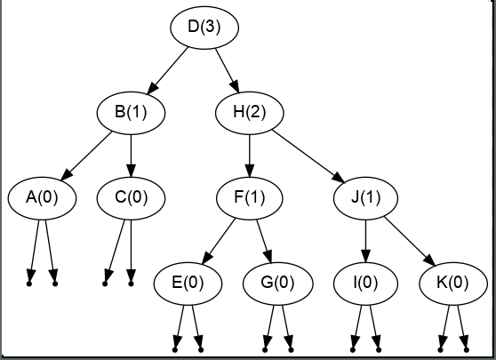
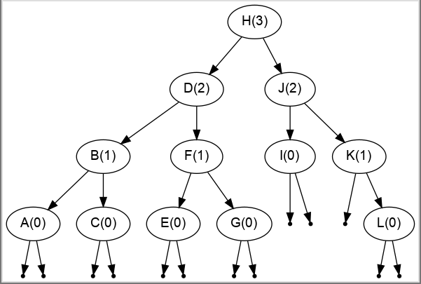

# avlbst
[Adelson-Velsky and Landis](https://en.wikipedia.org/wiki/AVL_tree) (AVL) Binary Search Tree (BST) in *python*

For a Binary Search Tree (not an AVL BST) with `N` nodes,
best case (balanced) height is `log(N)`, and worst case (linear/not
balanced) height is `N`.

Most operations, like `insert()`, `get()`, and `remove()` are
`O(height)`, so if we can keep the tree *balanced* (and the balancing
doesn't cost much), then we get the desired/best-case `O(log(N))` behavior.

An **AVL BST** requires recalculating the height of each node for
inserts and removes, and possibly rebalancing the tree. However, both of
these (recalculating height and rebalancing) are constant-time (`O(1)`)
operations done only at each node affected. For example, when calling
`insert()`, we search for the correct location to insert the new node,
and *only those nodes touched* will have their height changed. So
`insert()` is an `O(log(N))` operation (`O(1)` operation times `log(N)`
nodes) if the tree is balanced. The same applies to rebalancing: only
those nodes touched during insert or remove have to be rebalanced, and
rebalancing is at most one or two rotations.

## see/try example code:
    python3 example.py
    python3 rebalanceExample.py

## run the tests
    python3 tests.py

## before and after rebalancing

Here are some images produced from the `writeDotFile()` method.
The first image shows the BST with nodes `A` through `K` added:

Each node in the image shows the key (a letter) and the *height* of 
the node in parenthesis.

If we add node `L` to the above tree, then the height of D's right
subtree will be 4, and it's left subtree height will be 2. This triggers
the AVL rebalancing, which is a simple *left-rotation* of nodes `D` and
`H`. Here's how the tree looks after the insertion and rebalancing:

---

Useful Resources:
- [AVL tree wikipedia page](https://en.wikipedia.org/wiki/AVL_tree)
- [Eli Bendersky's *Visualizing binary trees* page](https://eli.thegreenplace.net/2009/11/23/visualizing-binary-trees-with-graphviz)
- [Walls and Mirrors C++ Book](https://www.amazon.com/Data-Abstraction-Problem-Solving-Mirrors/dp/0134463978)

<!--

#### how to set `git push` to use ssh
    git remote set-url origin git@github.com:<username>/<project>.git
    git remote show origin

-->
---

Last Modified: Wed Dec 12 10:28:11 EST 2018
